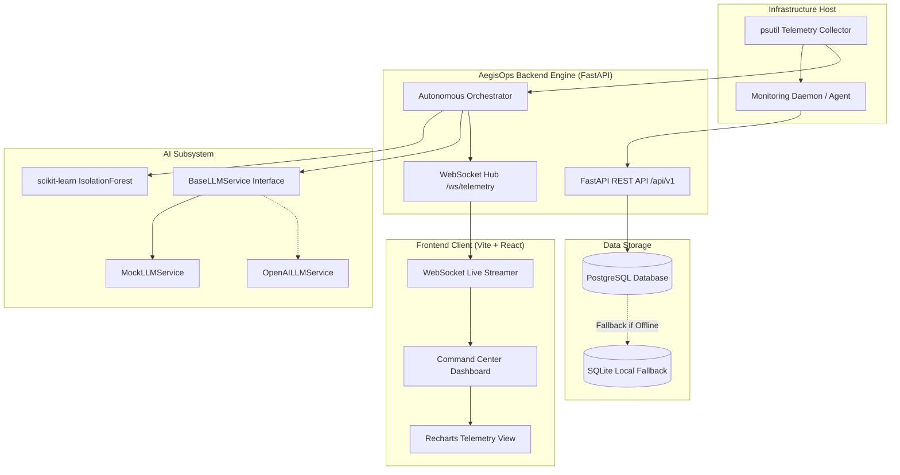

# AegisOps - Autonomous AI Operations Center Architecture

## System Overview

**AegisOps** is an autonomous operational telemetry and incident response platform designed for real-time visibility, automated anomaly scoring via machine learning, and AI-driven root cause analysis with mitigation suggestions.

## Architectural Layers

### 1. Frontend Layer (`frontend/`)
* **Framework**: React 18+ with TypeScript and Vite
* **Styling**: Tailwind CSS with custom dark mode cybersecurity / SRE theme
* **Visualizations**: Recharts for live time-series streaming of CPU, Memory, Disk, and Network
* **Connectivity**: Typed REST client for historical metrics, active incidents, and manual remediations; native WebSocket client for sub-second telemetry and anomaly streaming

### 2. Backend Layer (`backend/`)
* **Framework**: FastAPI with asynchronous lifespan management
* **Routing**: Clean separation into `/health`, `/metrics`, `/incidents`, and `/ai` endpoints
* **Communication**: Native WebSocket channel (`/ws/telemetry`) pushing telemetry snapshots and anomaly evaluations to all connected operations consoles
* **Configuration**: `pydantic-settings` reading from `.env` with strict validation

### 3. AI & Autonomous Orchestrator Layer (`aegisops/`)
* **Machine Learning**: `scikit-learn` IsolationForest unsupervised outlier detection across normalized multi-variate telemetry vectors (`[cpu_percent, memory_percent, disk_percent, process_count]`)
* **Service-Oriented LLM Abstraction**: Pluggable `BaseLLMService` protocol allowing hot-swapping between `MockLLMService`, `OpenAILLMService`, or custom on-prem inference engines without changing operational code
* **Autonomous Orchestration**: Automatic incident lifecycle triage (`OPEN` -> `INVESTIGATING` -> `MITIGATING` -> `RESOLVED`)

### 4. Database Layer (`database/`)
* **Primary Store**: PostgreSQL via SQLAlchemy 2.0 with connection pooling
* **Dev/Test Portability**: Graceful auto-fallback to SQLite when PostgreSQL is unreachable
* **Relational Schemas**:
  * `incidents`: Incident state, severity levels, root causes, AI remediations
  * `metric_logs`: Time-series telemetry snapshots
  * `audit_logs`: Immutable record of autonomous autopilot operations

### 5. Monitoring Layer (`monitoring/`)
* **Host Telemetry**: `psutil` collector measuring CPU, virtual memory, disk partitions, network counters, and top resource-consuming processes
* **Standalone Daemon**: Scriptable agent capable of standalone execution or integration into systemd / Docker containers
